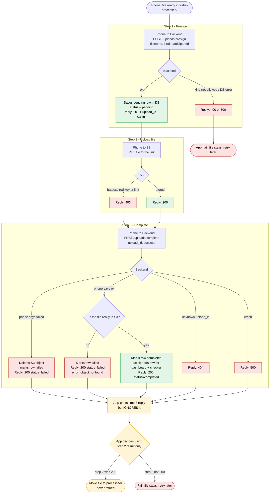

# Presigned upload flow (accel / sensorkit / sqlite)

Each step is a separate HTTP request with its own reply. Only step 3 returning
`"status":"completed"` means the backend recorded the upload. The app (and the
harness, which vendors the same code) currently decides pass/fail from step 2
only and ignores the step 3 reply.

Location (`locations_`) and HealthKit (`healthkit_`) files skip this flow: they
are sent in one multipart `POST /api/noauth/uploadfile`, which stores the file
and records the DB row in the same request.
